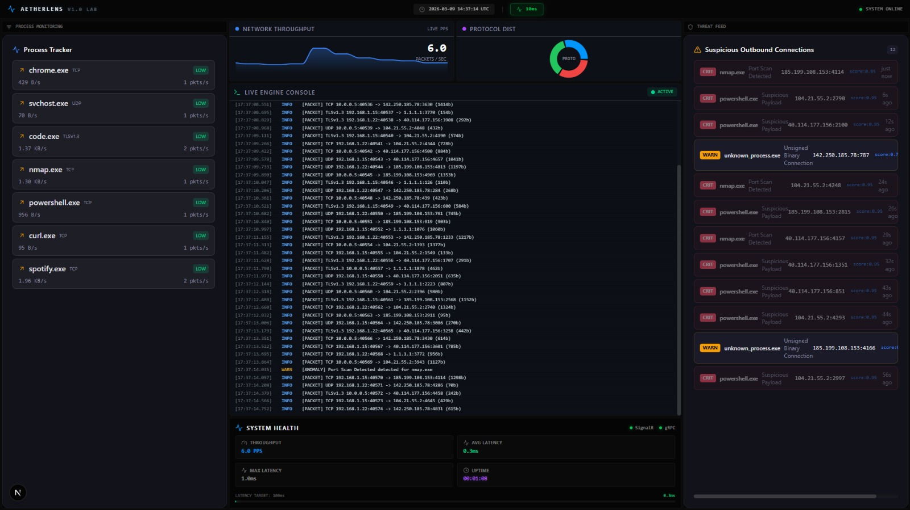

# AetherLens 👁️


**AetherLens** is a next-generation network traffic analysis platform designed for real-time visualization and security anomaly detection. By leveraging a high-performance **Rust** core engine, a scalable **.NET 8** backend, and a reactive **Next.js** dashboard, AetherLens bridges the gap between low-level packet capture and high-level security insights.

> **Note:** This project is designed for Windows environments utilizing the Npcap driver for raw packet capture.

## 🚀 Key Features

- **⚡ Zero-Copy Packet Capture:** Rust-based engine uses `libpnet` to process packets at line rate with minimal CPU overhead.
- **🛡️ Real-Time Anomaly Detection:**
  - **Port Scan Detection:** Identifies Nmap-style SYN scans and connect scans.
  - **Protocol Mismatch:** Flags traffic where the application protocol doesn't match the standard port (e.g., HTTP on port 22).
  - **Suspicious Outbound:** Detects connections to known C2 ports or unusual protocols (IRC, Telnet).
- **📊 Interactive War Room:**
  - 60 FPS real-time charts powered by SignalR and MessagePack.
  - Live process-level bandwidth tracking.
  - "Red Team" simulation mode for testing detection rules without live malware.
- **🔌 Modern Architecture:** gRPC streaming, WebSocket broadcasting, and a microservices-ready design.

## 📸 Screenshots


> The "War Room" dashboard showing real-time throughput and detected anomalies.

## 🛠️ Architecture

AetherLens follows a strict separation of concerns:

1.  **Core Engine (`aether_core`)**: Rust service running as a privileged process to capture packets.
2.  **Backend API (`AetherLens.Api`)**: .NET 8 service that aggregates streams and manages client state.
3.  **Dashboard (`web-dashboard`)**: Next.js 14 application for visualization.

For a deep dive into the system design, see [ARCHITECTURE.md](ARCHITECTURE.md).

## 🏁 Quick Start

### Prerequisites
- **Windows 10/11**
- **[Npcap](https://nmap.org/npcap/)** (Install with "WinPcap API-compatible Mode" checked)
- **Rust Toolchain** (`rustup`)
- **.NET 8 SDK**
- **Node.js 18+**

### Installation

1.  **Clone the repository:**
    ```bash
    git clone https://github.com/sehawq/aether-lens.git
    cd aether-lens
    ```

2.  **Setup Npcap SDK:**
    *   Download the **Npcap SDK** from [nmap.org](https://nmap.org/npcap/).
    *   Extract the ZIP.
    *   Copy the `Lib` folder from the SDK to `AetherLens/npcap-sdk/Lib`.
    *   *Why?* The Rust `pnet` crate needs these libraries to link against the NDIS driver.

3.  **Run the Lab:**
    Run the launcher script as **Administrator**:
    ```cmd
    start_lab.bat
    ```

4.  **Select Mode:**
    - **[1] Live Capture:** Captures real traffic from your Wi-Fi/Ethernet.
    - **[2] Demo Mode:** Simulates a cyber-attack scenario (perfect for testing UI).

## 🧪 Testing

We maintain a high standard of code quality with comprehensive test suites.

### Core Engine (Rust)
```bash
cd core-engine
cargo test --features packet-capture
```

### Backend API (.NET)
```bash
cd AetherLens.Tests
dotnet test
```

## 🗺️ Roadmap

- [x] Real-time Packet Capture (Windows/Npcap)
- [x] Basic Anomaly Detection (Port Scans)
- [x] Live Dashboard with SignalR
- [ ] **Linux Support** (eBPF / AF_PACKET)
- [ ] **PCAP Replay** (Analyze historical capture files)
- [ ] **Docker Support** (Containerized deployment)
- [ ] **Plugin System** (WASM-based detection rules)

## 🤝 Contributing

Contributions are welcome! Please read [CONTRIBUTING.md](CONTRIBUTING.md) for details on our code of conduct and the process for submitting pull requests.

## 📄 License

This project is licensed under the MIT License - see the [LICENSE](LICENSE) file for details.
